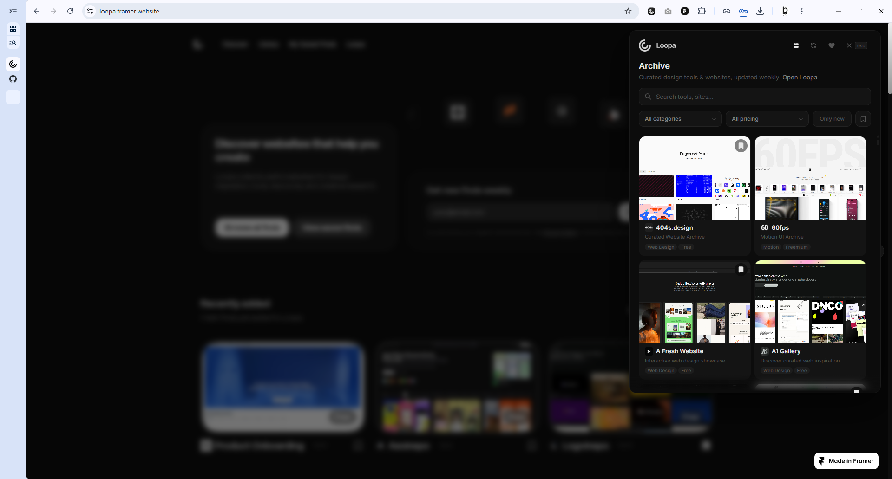
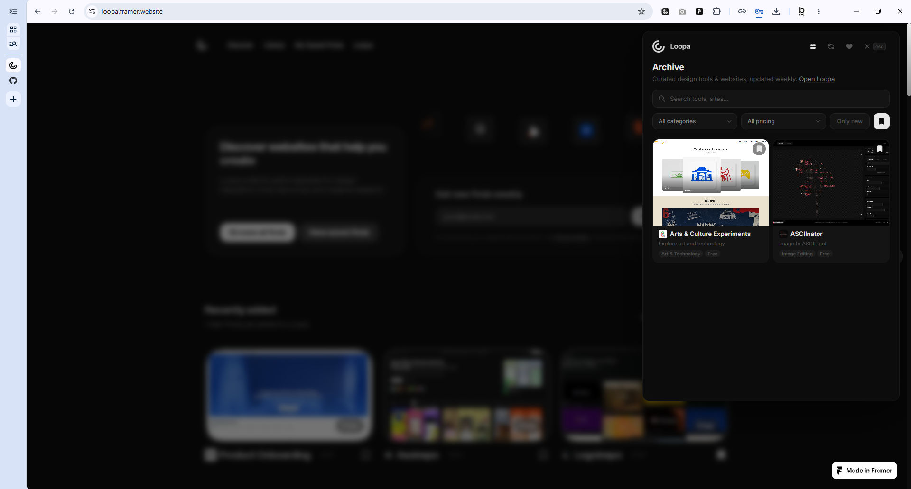
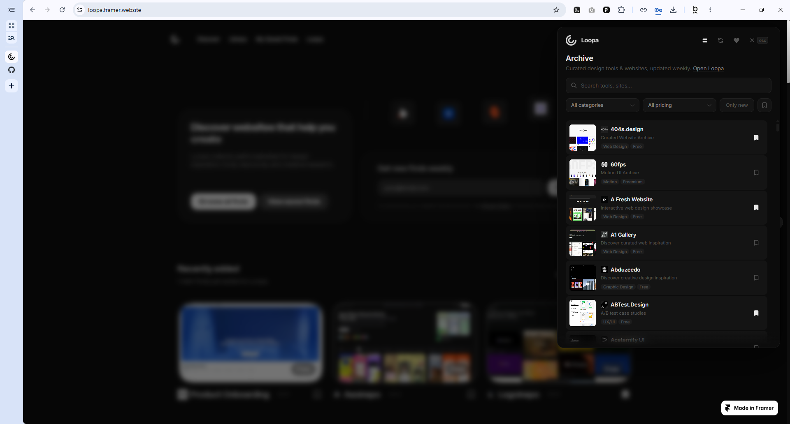
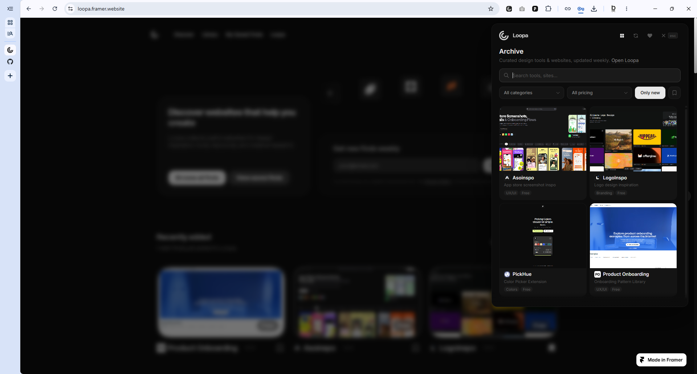
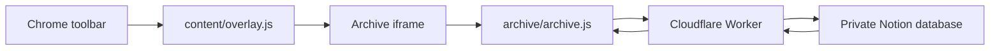

# Savault Chrome Extension

Savault is a Chrome extension for browsing, filtering, and saving a curated archive of design references without leaving the page you are on.

The extension opens as a compact overlay from the browser toolbar. It is built for fast visual scanning, precise search, and a lightweight saved-finds workflow.



## Highlights

- **One-click overlay:** open the Savault archive on top of any regular webpage.
- **Curated visual cards:** scan site previews, categories, descriptions, and pricing at a glance.
- **Precise search:** search across titles, URLs, hostnames, categories, subcategories, pricing, descriptions, meta descriptions, builders, stacks, and tags.
- **Smart filters:** filter by category, pricing, new entries, and saved finds.
- **Saved finds:** keep favorites locally in the browser and revisit them from the saved view.
- **Empty-state flow:** saved finds has a dedicated empty state that guides users back into exploration.
- **Private data boundary:** archive data is served through a Cloudflare Worker so private Notion credentials stay server-side.

## Screenshots

| Archive | Saved Finds |
| --- | --- |
|  |  |

| Compact List | New Filter |
| --- | --- |
|  |  |

## How It Works



1. The toolbar action injects `content/overlay.js` into the active tab.
2. The content script creates a Shadow DOM overlay.
3. The overlay loads `archive/archive.html` inside an iframe.
4. The archive UI requests normalized data from the configured Worker API.
5. Saved finds and view preferences are stored locally in browser storage.

## Project Structure

```text
archive/       Overlay UI, search, filters, cards, saved-state views
assets/        Brand, ASCII, font, and README assets
background/    Manifest V3 service worker
content/       Overlay injector and Savault website sync bridge
icons/         Extension icons
lib/           Browser API, storage, archive API, and icon helpers
worker/        Cloudflare Worker for archive data
build.ps1      Production zip build script
manifest.json  Chrome extension manifest
```

## Local Development

1. Open `chrome://extensions/`.
2. Enable **Developer mode**.
3. Click **Load unpacked**.
4. Select this project folder.
5. Pin Savault to the toolbar.
6. Click the Savault icon on a normal `http`, `https`, or local file page.

The extension is configured to read archive data from `lib/api-config.js`.

## Configuration

`lib/api-config.js` contains the Worker endpoint used by the archive UI:

```js
export const SAVAULT_API_BASE = "https://your-worker.workers.dev/";
export const SAVAULT_API_KEY = "";
```

For production, keep private Notion tokens inside the Worker environment, not in the extension bundle.

## Worker

The Worker lives in `worker/` and maps private database pages into the public archive item shape consumed by the extension.

Typical setup:

```powershell
cd worker
npm install
npx wrangler dev
```

Required Worker secrets:

- `NOTION_TOKEN`
- `NOTION_DATABASE_ID`

Optional:

- `SAVAULT_API_KEY`

## Packaging

Run the build script from the repository root:

```powershell
.\build.ps1
```

The script:

- checks for obvious leaked secrets,
- copies only extension files needed for distribution,
- excludes private/example-only files,
- creates `savault-chrome-extension-v<version>.zip`.

## Privacy

- Saved finds are stored locally in browser storage.
- The extension does not bundle private Notion credentials.
- Archive content is fetched from the configured Worker API.
- The Savault website sync bridge only runs on `https://savault.framer.website/*`.

## License

MIT License. See [LICENSE](LICENSE).
